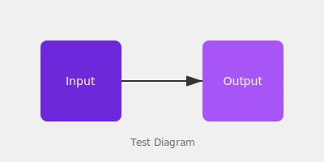

This is a page bundle post to test the Hugo-style directory structure.

## Local Images

Here's an image using a relative path:

And another with the `./` prefix:

## How It Works

This post lives at `content/posts/bundle-test/index.md` with assets in the same directory.

The image paths above are automatically transformed to `/posts/bundle-test/diagram.svg` when rendered.
