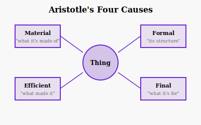

Why does this statue exist? Modern science would point to the sculptor's actions—the efficient cause. But Aristotle thought this was only part of the story. A complete explanation requires four causes.

## The Four Causes

**Material Cause**: What is it made of? The statue is made of bronze. The material constrains what can be made and how.

**Formal Cause**: What is its form or structure? The statue has the shape of a man. The form makes the bronze into *this* statue rather than something else.

**Efficient Cause**: What brought it about? The sculptor carved the statue. This is the "cause" in the modern sense—the agent or event that produces the effect.

**Final Cause**: What is it for? The statue was made to honor a hero. The purpose or goal explains why the thing exists.

## Final Causes in Nature

Aristotle applied this framework to nature. Why do ducks have webbed feet? The material cause is flesh and bone. The efficient cause is biological development. The formal cause is the duck's essential nature. But the final cause—what the feet are *for*—is swimming.

This teleological thinking dominated science for two millennia. But the scientific revolution rejected final causes. Nature has no purposes; it simply operates according to mechanical laws.

## The Modern Rejection

Francis Bacon called final causes "barren virgins"—they produce no offspring. Darwin seemed to deliver the death blow: apparent design is the result of blind natural selection, not purpose.

But has something been lost? Many philosophers argue that we can't fully explain living things without reference to function. A heart isn't just a pump-shaped object; it's a thing whose function is to pump blood. Remove the "what for" and something essential disappears.

## Recovery of Teleology

Recent philosophy has seen renewed interest in teleology. Analytic philosophers like Thomas Nagel argue that consciousness and reason can't be fully explained in purely mechanistic terms. Some form of purpose may need to return to our scientific picture.

The debate continues. But Aristotle's insight remains valuable: there's more than one way to ask "why?"
